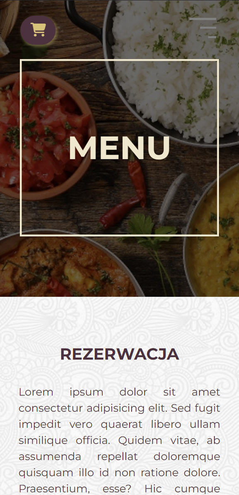
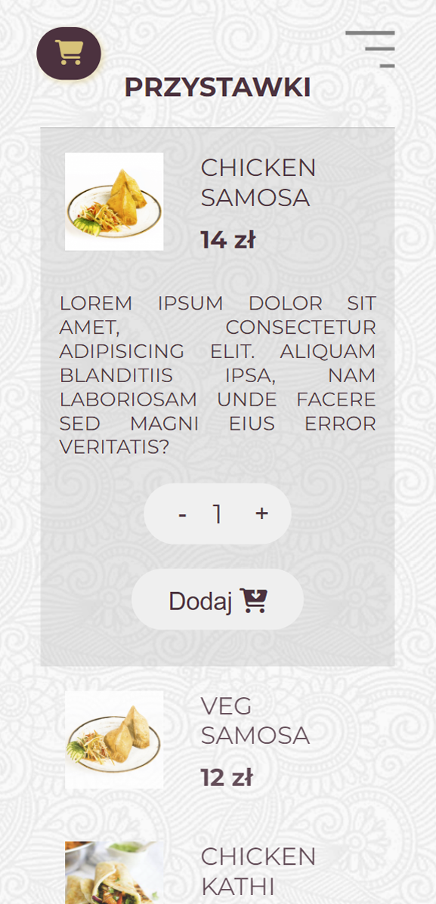

# Namaste Indian Restaurant 

## Try me
#### [namaste-restaurant.netlify.app](namaste-restaurant.netlify.app)

## About
It's a food order App for an imaginary indian restaurant. This Single Page aplication allows you to order your favourite indian-meals and send your order to fire-base database.The site was created with a “mobile-first” approach but it has also desktop version. 

## Features
- Mobile accessbility
- Responsive web design
- Food order App
- Cart modal
- Forms for reservation and order meals
- Menu with categories accordeon

## Tech
- React JS
- Vite
- React-router
- Redux
- Fire-base database
- CSS module

## How to run
Quiz Game requires ViteJS to run; 
1. Clone repository
2. Use ``npm run dev`` to run it locally

## Screens

### Mobile
 
 
 
 
 
 
 

### Desktop

## License
MIT

